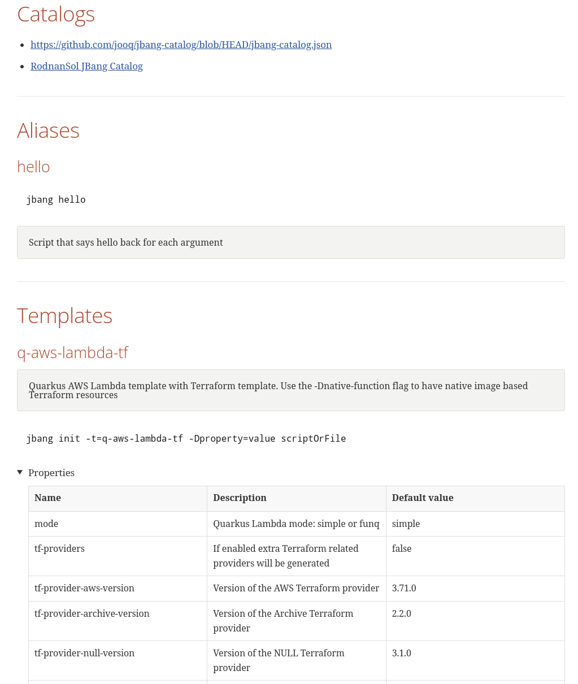
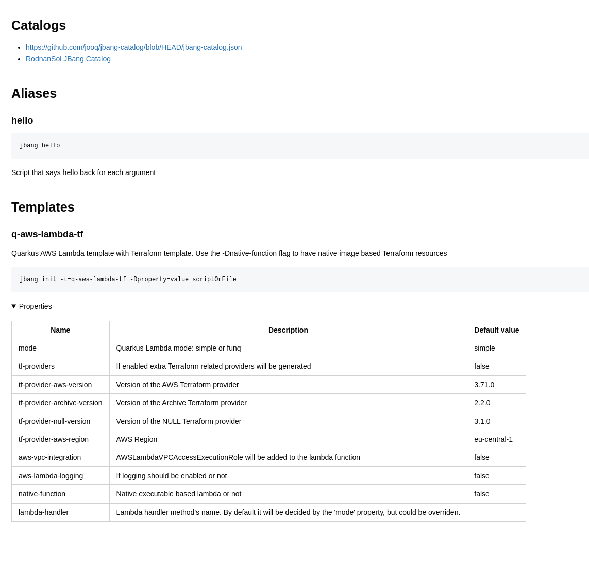

= JBang Catalog Document Generator
ifndef::env-github[]
:icons: font
endif::[]
ifdef::env-github[]
:caution-caption: :fire:
:important-caption: :exclamation:
:note-caption: :paperclip:
:tip-caption: :bulb:
:warning-caption: :warning:
endif::[]
:toc:
:toc-placement!:
:toclevels: 4

[.text-center]
image:https://img.shields.io/maven-central/v/org.rodnansol/jbang-catalog-document-generator.svg[Maven Central]
image:https://img.shields.io/badge/License-Apache_2.0-blue.svg[Apache 2.0]
image:https://img.shields.io/twitter/url/https/twitter.com/rodnansol.svg?style=social&label=Follow%20%40RodnanSol[]
image:https://dcbadge.vercel.app/api/server/USyh6XUjvP[Discord]

toc::[]

== Goals

=== Introduction

https://jbang.dev/[JBang] is a tool that lets you write Java apps easily, no Maven, no Gradle, just pure Java classes with some small directives as comments in the header.

[source,java]
----
///usr/bin/env jbang "$0" "$@" ; exit $?

import static java.lang.System.out;

public class hello {

    public static void main(String... args) {
        out.println("Hello World");
    }
}

----

[source,bash]
----
jbang hello.java
[jbang] Building jar...
Hello World
----

With the help of JBang, developers are able to create and *share* their scripts for the public! It can be done with a so called https://www.jbang.dev/documentation/guide/latest/alias_catalogs.html#catalogs[catalog].

Catalogs (simple JSON files) can be put into a Git repository and other developers are able to fetch, build and run the scripts listed in them.

.An example jbang-catalog.json
[%collapsible]
====
[source,json]
----
{
  "catalogs": {
    "jooq": {
      "catalog-ref": "https://github.com/jooq/jbang-catalog/blob/HEAD/jbang-catalog.json"
    },
    "rodnansol": {
      "catalog-ref": "https://github.com/rodnansol/jbang-catalog/blob/HEAD/jbang-catalog.json",
      "description": "Rodnan Sol JBang Catalog"
    }
  },
  "aliases": {
    "hello": {
      "script-ref": "hello.java",
      "description": "Script that says hello back for each argument"
    }
  },
  "templates": {
    "q-aws-lambda-tf": {
      "file-refs": {
        "{filename}": "aws/aws-lambda.java.qute",
        "build-application": "aws/build-application",
        "application.properties": "aws/application.properties",
        "lambda-{basename}.tf": "aws/lambda.tf.qute"
      },
      "description": "Quarkus AWS Lambda template with Terraform template. Use the -Dnative-function flag to have native image based Terraform resources",
      "properties": {
        "mode": {
          "description": "Quarkus Lambda mode: simple or funq",
          "default": "simple"
        },
        "tf-providers": {
          "description": "If enabled extra Terraform related providers will be generated",
          "default": false
        },
        "tf-provider-aws-version": {
          "description": "Version of the AWS Terraform provider",
          "default": "3.71.0"
        },
        "tf-provider-archive-version": {
          "description": "Version of the Archive Terraform provider",
          "default": "2.2.0"
        },
        "tf-provider-null-version": {
          "description": "Version of the NULL Terraform provider",
          "default": "3.1.0"
        },
        "tf-provider-aws-region": {
          "description": "AWS Region",
          "default": "eu-central-1"
        },
        "aws-vpc-integration": {
          "description": "AWSLambdaVPCAccessExecutionRole will be added to the lambda function ",
          "default": false
        },
        "aws-lambda-logging": {
          "description": "If logging should be enabled or not",
          "default": false
        },
        "native-function": {
          "description": "Native executable based lambda or not",
          "default": false
        },
        "lambda-handler": {
          "description": "Lambda handler method's name. By default it will be decided by the 'mode' property, but could be overriden."
        }
      }
    }
  }
}

----
====

[sidebar]
--
*A catalog can store:*

* References to other catalogs (in local environment it provides ability to alias scripts)
* Create aliases
* Create templates with properties
--

=== Project

With the help of this project the goal is to give a unified solution for these JBang catalog repositories, developers who are sharing their work with the outside world, they should do it with fashion.

Let us introduce the *JBang Catalog Document Generator* that takes your jbang-catalog.json file and it converts to a:

* AsciiDoc
* Markdown

document that can be put into your repository and others can easily browse your available scripts.

== Usage

=== GitHub Action

[source,yaml]
----
name: update-catalog
on:
  push:
    branches:
      - main
  workflow_dispatch:

jobs:
  update-catalog-documentation:
    runs-on: ubuntu-latest
    name: Update catalog documentation
    if: startsWith(github.event.head_commit.message, 'Updating jbang-catalog documentation') != true
    steps:
      - uses: actions/checkout@v3
      - uses: rodnansol/jbang-catalog-document-generator-action@v0.1.0 # <.>
        name: Generate catalog document
        with:
          version: early-access # <.>
          arguments: generate jbang-catalog.json -o README.adoc --custom-header=header.adoc --include-generation-date=true # <.>
      - name: Commit document changes
        shell: bash
        run: |
          git add README.adoc # <.>
          git config --global user.email "${{ secrets.COMMITTER_EMAIL }}"
          git config --global user.name "${{ secrets.COMMITTER_NAME }}"
          git commit -m "Updating jbang-catalog documentation" # <.>
          git push origin main
----
<1> Add the `rodnansol/jbang-catalog-document-generator-action` to your action. Check the latest version before doing so.
<2> Specify the version of the CLI tool you want to use.
<3> By default, the `generate jbang-catalog.json` command will be executed with, if more customization is needed specify it here
<4> Do not forget to add it to the staging area
<5> Commit and then push the files

More information about the action can be found https://github.com/rodnansol/jbang-catalog-document-generator-action[here].

=== Java JAR

Download the uber-jar/fatjar and run it with *Java 17*(!).

[source,bash]
----
java -jar jbang-catalog-document-generator-cli/target/jbang-catalog-document-generator-cli-999-SNAPSHOT.jar generate
Usage: <main class> generate [-g] [-cc] [-cus] [-hfdr] [-toc]
                             [-cf=<customFooterFilePath>]
                             [-ch=<customHeaderFilePath>] [-o=<outputFile>]
                             [-pcn=<preferredCatalogName>]
                             [-t=<customTemplatePath>] [-toc-l=<tocLevels>]
                             [-toc-p=<tocPlacement>] [-toc-t=<tocTitle>]
                             [-tt=<templateType>] <inputFile>
Generates a documentation for a given jbang-catalog.json file
      <inputFile>   The input JSON file to convert.
      -cc, --check-checksum
                    Defines if the checksum check should be running or not.
                      Checksum check is enabled by default.
      -cf, --custom-footer=<customFooterFilePath>
                    Path to a custom footer.
      -ch, --custom-header=<customHeaderFilePath>
                    Path to a custom header.
      -cus, --collapsible-usage-section
                    Defines if the usage section should be collapsible or not
  -g, --include-generation-date
                    Defines if the generation date should be put into the
                      document or not.
      -hfdr, --header-footer-direct-render
                    Defines if the header and footer should be directly
                      rendered into the document or not. In case of AsciiDoc it
                      will not use the `include` directive.
  -o, --output=<outputFile>
                    The output AsciiDoc file name. Defaults to 'jbang-catalog.
                      adoc'
      -pcn, --preferred-catalog-name=<preferredCatalogName>
                    Defines the preferred catalog name.
  -t, --template=<customTemplatePath>
                    Custom template path.
      -toc, --table-of-contents
                    Enable the table of contents or not
      -toc-l, --table-of-contents-levels=<tocLevels>
                    Levels of the table of contents (In case of AsciiDoc)
      -toc-p, --table-of-contents-placement=<tocPlacement>
                    Placement of the table of contents (In case of AsciiDoc)
      -toc-t, --table-of-contents-title=<tocTitle>
                    Title of the table of contents
      -tt, --template-type=<templateType>
                    Template type.
----

=== JBang

A tool for JBang will not be truly JBang related if it would not be having a JBang script.

Check the *https://github.com/rodnansol/jbang-catalog-document-generator/blob/master/jbang/src/JbangCatalogDocumenter.java[jbang]* folder for the script or check the https://github.com/rodnansol/jbang-catalog-document-generator/releases[releases] the use the newly released stable one.

=== Binary

Coming soon.

=== Docker image

The tool is available within a Docker image, check the https://github.com/rodnansol/jbang-catalog-document-generator/pkgs/container/jbang-catalog-document-generator[packages] of the organization.

[source,bash]
----
docker run -v $(pwd):/resources ghcr.io/rodnansol/jbang-catalog-document-generator:<version> generate /resources/jbang-catalog.json -o /resources/jbang-catalog.adoc
----

== Output

=== AsciiDoc

ifndef::env-github[]
image::image$adoc-result.png[]
endif::[]
ifdef::env-github[]

endif::[]

=== Markdown

ifndef::env-github[]
image::image$md-result.png[]
endif::[]
ifdef::env-github[]

endif::[]

== Customization options

=== Custom header and footer
Custom header and custom footer can be attached to make sure introductions and other important stuff can be put into the final document.

=== Alias usages

The alias entries can be extended with a help/usage section where the usage of the script can have a detailed description, for example if it is a CLI application the usage of the app or the flags can be put here.

.Example jbang-catalog.json
[source,json]
----
{
  "aliases": {
    "hello": {
      "script-ref": "hello.java",
      "description": "Script that says hello back for each argument"
    }
  }
}
----

.hello.txt
[source,txt]
----
This is a usage file, that will be rendered below the `hello` alias entry.

!%$&@ So you want to use this script? !%$&@

< Let me show you how you can use it. >
----

==== Result in AsciiDoc

ifndef::env-github[]
include::example$document-with-usage.adoc[]
endif::[]
ifdef::env-github[]
include::docs/modules/ROOT/examples/document-with-usage.adoc[]
endif::[]

It can put behind a collapsible section with the `-cus` (`--collapsible-usage-section`) flag.

'''
=== Working directory

Since the 0.2.0 version the current working directory can be overwritten which can help you to read the usages from a different path if you wish. It can be overwritten with the `-Dapp.document.current-working-directory=` flag when using the `java` command.

.Example
[source,bash]
----
java -Dapp.document.current-working-directory=new-working/directory -jar jbang-catalog-document-generator-cli.jar generate jbang-catalog.json
----

In this case the *alias* usages will be read from the *new-working/directory* folder.

== Contribution

=== Fork

Please fork the project if you would like to contribute.

=== How to build the project?

The project requires at least *GraalVM 22.3* / *Java 17*, if SDKMan is installed on your machine `sdk e` command could be used in the terminal to set up the required Java version.

- To build the project just run: `mvn package`

=== Code formatter

The project contains a `.editorconfig` file, and it should be utilized as well.

During build time Checkstyle checks the conventions.

=== Commit messages

The commit messages are based on the **conventional-commits**, please apply those rules.

Learn more link:https://www.conventionalcommits.org[here].

== Contributors

Check the list of contributors https://github.com/rodnansol/jbang-catalog-document-generator/tree/master/CONTRIBUTORS.md[here].

